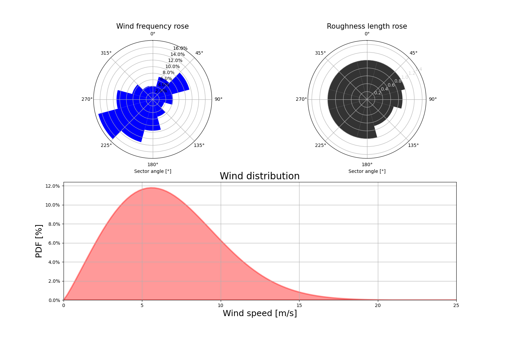

.. _getting_started:

===============
Getting Started
===============

Installation
------------

.. raw:: html

    

        

            

                

                

                    Install with Pip
                

                

                    

                        <b>wind-stats</b> can be installed via pip from 
                        <a class="reference external" href="https://pypi.org/project/wind-stats">PyPI</a>.
                    

                

                

.. code-block:: bash

   pip install wind-stats

.. raw:: html

                

                

            

        

    

Wind Turbine
------------

Wind turbine can be defined as follow : 

.. ipython:: python

    from wind_stats import WindTurbine
    from wind_stats.units import units

    # https://en.wind-turbine-models.com/turbines/1467-siemens-swt-3.3-130-ln
    # Power curve data

    wind_speed = [3, 4, 5, 6, 7, 8, 9, 10, 11, 12, 13, 14, 15, 16, 17, 18, 19, 20, 21, 22, 23, 24, 25] * units("m/s")
    power = [43., 184., 421., 778., 1270., 1905., 2593., 3096., 3268., 3297., 3300., 3300., 3300., 3300., 3300., 3300., 3300., 3300., 3300., 3300., 3300., 3300., 3300. ] * units.kW
    
    wind_turbine = WindTurbine("Siemens SWT-3.3-130 LN",(wind_speed, power), 130, 135)
    wind_turbine

.. ipython:: python

    @savefig power_curve.png
    In [1]: import matplotlib.pyplot as plt
       ...: plt.xlabel("Wind speeds [m/s]")
       ...: plt.ylabel("Power [kW]")
       ...: plt.grid()
       ...: plt.plot(wind_speed.m, power.m, color="gold")

.. ipython::
    :okwarning:

    @savefig power_coefficients.png
    In [1]: wind_speed, cp = wind_turbine.get_power_coefficients()
       ...: plt.figure(figsize=(10,6))
       ...: plt.plot(wind_speed, cp, label="power coefficient")
       ...: plt.hlines(16/27, 0, 25,color = "red", label="Betz limit")
       ...: plt.title("$C_p$ Power coefficient")
       ...: plt.xlabel("Wind speed [m/s]")
       ...: plt.ylabel("$C_p$ [-]")
       ...: plt.xlim(3, 25)
       ...: plt.ylim(0, 0.7)
       ...: plt.grid()
       ...: plt.legend();

    In [1]: plt.show()

Wind Distribution
-----------------

To evaluate energy production, one need to know the wind distribution at the site the wind turbine is going to be installed.

To do that **wind-stats** is making things easy for you with using WASP compatible files that can be downloaded with `Global Wind Atlas`_.

GWC (Global Wind Climate) File can be downloaded through the `Global Wind Atlas`_ or with ``get_gwc_data`` function.

.. note::

    The generalized wind climate file, also known as a wind atlas file,
    contains the sector-wise frequency of occurrence of the wind (the wind rose) as well as
    the wind speed frequency distributions in the same sectors (as Weibull A- and k-parameters).

.. important::
    You need to install `requests` to use `get_gwc_data` function.

.. _`Global Wind Atlas`: https://globalwindatlas.info/

.. seealso::
    
    More options are available to generate wind distribution.

.. ipython::
    .. :verbatim:

    In [1]: from wind_stats import get_gwc_data

    In [2]: latitude, longitude = 48.4569 , 5.583

    In [3]: gwc_data = get_gwc_data(latitude, longitude)

    In [4]: gwc_data
    Out[4]: 
    <xarray.Dataset>
    Dimensions:    (height: 5, roughness: 5, sector: 12)
    Coordinates:
    * roughness  (roughness) float64 0.0 0.03 0.1 0.4 1.5
    * height     (height) float64 10.0 50.0 100.0 150.0 200.0
    * sector     (sector) float64 0.0 30.0 60.0 90.0 ... 240.0 270.0 300.0 330.0
    Data variables:
        A          (roughness, height, sector) float64 5.75 6.79 7.73 ... 6.31 5.83
        k          (roughness, height, sector) float64 2.025 2.084 ... 1.916 2.057
        frequency  (roughness, sector) float64 3.72 5.19 9.26 ... 10.25 6.12 4.17
    Attributes:
        coordinates:  (5.583, 48.444)

Or with a downloaded GWC file through `Global Wind Atlas`_ interface:

.. ipython::
    :verbatim:

    In [14]: from wind_stats import GWAReader

    In [15]: with open("gwa3_gwc_j9mubhkw.lib") as f:
       ....:    gwc_data = GWAReader.load(f)
       ....:

Weibull A- and k-parameters & frequencies are interpolated provided hub-height & roughness
length for each wind sector to generate the Weibull wind distribution.

.. seealso::
    :ref:`roughness_length` user guide can help you evaluate roughness length at your site.

.. ipython:: python

    from wind_stats import WindDistribution
    import matplotlib.pyplot as plt

    roughness_lengths_distribution = [1, 1, 1, 0.9, 0.7, 0.7, 1, 1 , 1, 1, 1, 1]

    wind_distribution = WindDistribution.from_gwc(
        gwc_data,
        roughness_lengths_distribution,
        wind_turbine.hub_height.m
    )
    wind_distribution

.. ipython:: python
    :suppress:

    from matplotlib.ticker import PercentFormatter
    from wind_stats.gwa_reader import get_gwc_data, get_weibull_parameters

    roughness_lengths_distribution = [1, 1, 1, 0.9, 0.7, 0.7, 1, 1 , 1, 1, 1, 1]

    wind_sectors = gwc_data.sector
    A, k, frequencies = get_weibull_parameters(gwc_data, roughness_lengths_distribution, 135)
    wind_distribution = WindDistribution.from_gwc(gwc_data, roughness_lengths_distribution, 135)

    plt.figure(figsize=(15,10))
    theta = wind_sectors * 2 * np.pi / 360
    width =  2 * np.pi / 12

    ax = plt.subplot(221, projection='polar')
    ax.bar(theta, frequencies, width=width, color="blue", bottom=0.0, alpha=1, label="frequencies")
    ax.set_theta_zero_location("N")
    ax.set_theta_direction(-1)
    ax.yaxis.set_major_formatter(PercentFormatter(xmax=100))
    ax.set_title("Wind frequency rose", size=15)
    plt.xlabel("Sector angle [°]")

    ax = plt.subplot(222, projection='polar')
    ax.bar(theta, roughness_lengths_distribution, width=width, color="black", bottom=0.0, alpha=0.8, label="Roughness length [m]")
    ax.set_theta_zero_location("N")
    ax.set_theta_direction(-1)
    plt.ylim(0,1.5)
    plt.xlabel("Sector angle [°]")
    label_position=ax.get_rlabel_position()
    ax.set_rlabel_position(60)
    # ax.set_rticks([0, 0.2, 0.4, 0.6, 0.8, 1,1.2, 1.4], minor=False)  # Less radial ticks
    ax.tick_params(axis='y', colors='lightgrey')
    ax.set_title("Roughness length rose", size=15)

    wind_speeds = np.linspace(0, 25, 100)
    ax = plt.subplot(212)

    plt.xlabel("Wind speed [m/s]", size=18)
    plt.ylabel("PDF [%]", size=18)
    plt.title("Wind distribution", size=20)

    plt.xlim(left=0, right=25)
    plt.grid(True)
    ax.yaxis.set_major_formatter(PercentFormatter(xmax=1))
    pdf = wind_distribution.pdf(wind_speeds)
    plt.fill_between(wind_speeds, pdf,color = "red", linewidth=3, alpha=0.4)
    plt.ylim(bottom=0)
    plt.savefig("wind_distribution.png")

Site
----

A Site is defined with GPS coordinates (latitude, longitude) & wind distribution.

.. ipython:: python

    from wind_stats import Site

    site = Site(latitude, longitude, wind_distribution)

.. tip::

    You can generate site from `Global Wind Atlas`_ wind distribution :

    .. code-block:: python

        from wind_stats import Site

        Site.from_gwc(latitude, longitude, roughness_lengths_distribution, height)
    

After defining our site we can now evaluate our annual energy output:

.. ipython:: python

    annual_energy = wind_turbine.get_annual_energy_production(site).to("MWh")
    print(annual_energy)

.. ipython:: python

    energy = wind_turbine.get_energy_production(site, 3 * units.months).to("MWh")
    print(energy)

.. _`Global Wind Atlas`: https://globalwindatlas.info/